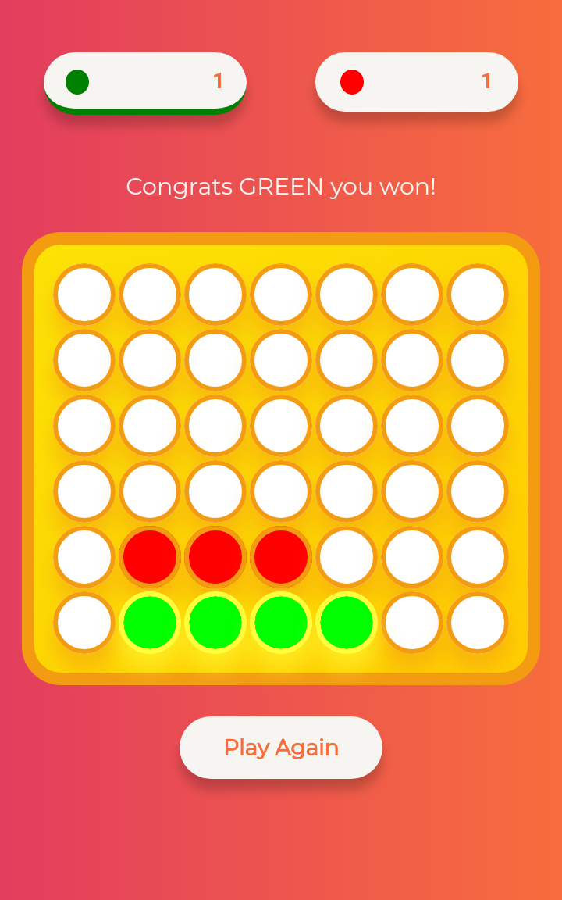
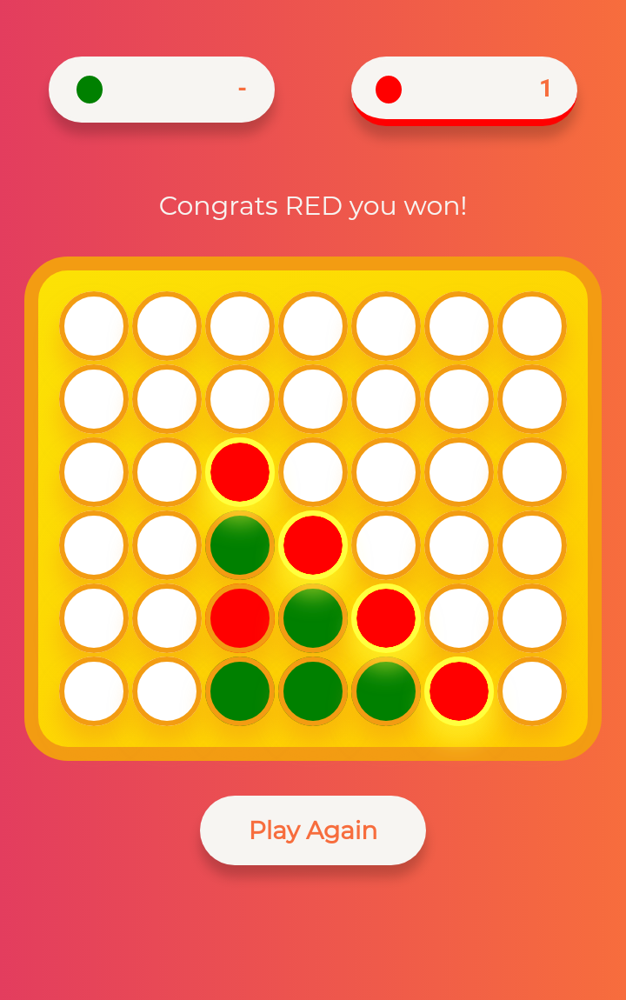
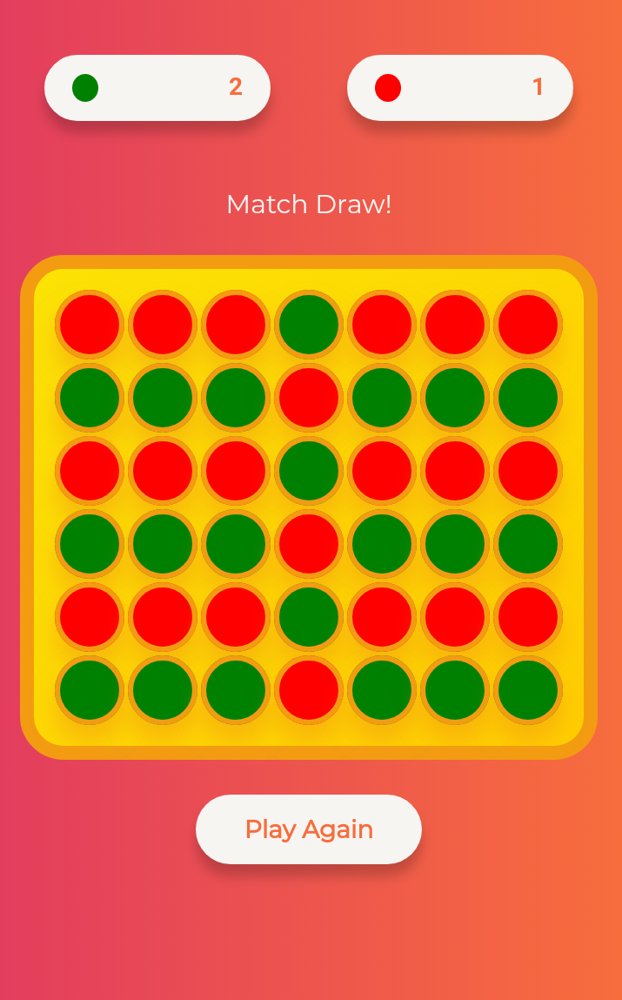

# Chipstar-App
Mobile Application of the Chipstar Game. Also known as Connect 4 , 4 in a row.

Built on html5, css3 & javaScript

This is a mobile application version of my project Chipstar [https://github.com/Naimul-Islam-Siam/Chipstar]

Screenshots from App : 

Download The Android App : https://drive.google.com/open?id=1Ft6-_jn2jmpDroeTc_v8eBEDXyjjq-Cm

Download The Windows App : https://drive.google.com/open?id=1iIOpbmGHntj9sFrFqZwGGbcF-Qqc19NT

Play The Web Version : https://naimul-islam-siam.github.io/Chipstar/

Special Mentions : 
Debasish Sarker Joy [helped solving an important problem]
Molla Zihan Uddin [designed the logo icon]
